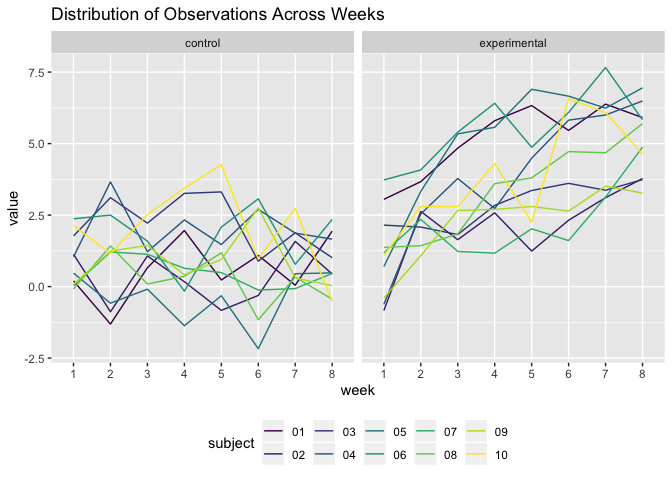
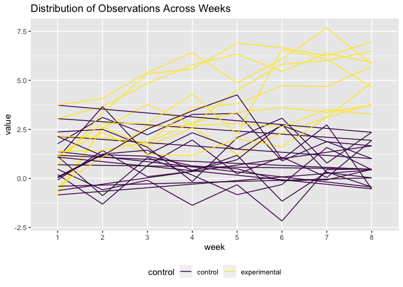
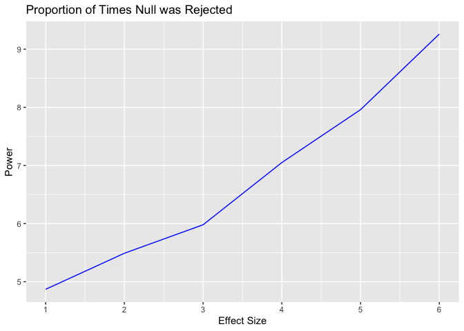
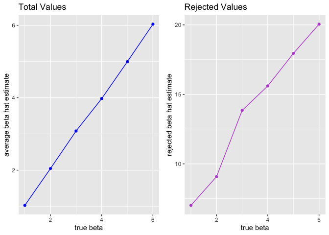

Homework 5
================
Ani Bilazarian
11/8/2019

# Problem 1

*Read in IRIS data*

``` r
set.seed(10)

iris_with_missing = iris %>% 
  map_df(~replace(.x, sample(1:150, 20), NA)) %>%
  mutate(Species = as.character(Species))
```

*Function replacing NAs*

``` r
missing_data = function(x)  {
  
  if(is.numeric(x)){
    x = replace_na(x, mean(x, na.rm = TRUE))
  } 
  else if (is.character(x)){
    x = replace_na(x, "virginica")
  
    }}
  
iris_with_missing =  map(iris_with_missing, missing_data) %>% 
  as_tibble() 
```

This function replaced numeric NA values with the mean of the remaining
observations, and character values with the name ‘virginica’. We then
mapped the function onto the same datset to fill in the values.

# PROBLEM 2

*Writing Function to Import Multiple Files at Once*

``` r
library(readxl)

files = list.files("./data", pattern = NULL, all.files = FALSE, full.names = FALSE) 

problem_2 = data_frame(filename = files) %>% 
mutate(file_contents = map(filename, ~ read_csv(file.path("./data", .)))) %>% 
separate("filename", into = c("control", "subject")) %>% 
  unnest(file_contents) %>% 
  mutate(control = recode(control, 'con' = "control", 'exp' =  "experimental"))
```

While we need to pivot longer in order to plot this dataset, I think it
is easier to read and tidier to visualize weeks as columns in order to
see the distribution over time. So I left the dataset as is and will use
pivot longer when I build my Spaghetti plots.

*Spaghetti Plot 1: Separated by Face\_Grid to show Control versus
Experimental*

``` r
problem_2 %>% 
pivot_longer(week_1:week_8, names_to = "week", names_prefix = "week_") %>% 
  ggplot(aes(x = week, y = value, group = subject, color = subject)) + geom_path() + labs(title = "Distribution of Observations Across Weeks") + facet_grid(~control) + viridis::scale_color_viridis(discrete = TRUE) + theme(legend.position = "bottom")
```

<!-- -->

This plot allows us to see that the experimental group increased as time
went on while the control group did not change much over time. This plot
specifically allows us to see the distribution for each subject, for
examle, the highest values in the control group are attributed to
subject 10.

*Spaghetti Plot 2: One graph to show Control and Experimental together*

``` r
problem_2 %>% 
  pivot_longer(week_1:week_8, names_to = "week", names_prefix = "week_") %>% 
  ggplot(aes(x = week, y = value, group = subject, color = control)) + geom_path() + labs(title = "Distribution of Observations Across Weeks") + viridis::scale_color_viridis(discrete = TRUE) + theme(legend.position = "bottom")
```

<!-- -->

This graph does not allow us to see distinct values for each subject,
but does allow us to compare control versus experimental more easily for
any given week. For example, we can see that at week 1-2, control and
example have similar starting values but around week 3 we can see a
change in the experimental group.

# PROBLEM 3

*Writing a function and loop for multiple betas*

``` r
library(broom)
set.seed(17)

sim_regression = function(n = 30, beta0 = 2, beta1) {

    sim_data = tibble(
    x = rnorm(n, mean = 1, sd = 1),
    y = beta0 + beta1 * x + rnorm(n, 0, 50))
  
  ls_fit = lm(y ~ x, data = sim_data) %>% broom::tidy()

  ls_fit
}

sim_regression(30, 2, 0)
```

    ## # A tibble: 2 x 5
    ##   term        estimate std.error statistic p.value
    ##   <chr>          <dbl>     <dbl>     <dbl>   <dbl>
    ## 1 (Intercept)    -17.4      23.5    -0.738   0.467
    ## 2 x               12.6      15.2     0.823   0.417

``` r
sim_results = 
  rerun(10000, sim_regression(30, 2, 0)) %>% 
  bind_rows() %>% 
  select(term, estimate, p.value) %>% 
  knitr::kable()
```

``` r
beta_list = list("b_1"  = 1, 
              "b_2"  = 2, 
              "b_3" = 3, 
              "b_4" = 4,
              "b_5" = 5,
              "b_6" = 6
              )

output = vector("list", length = 6)

for (i in 1:6) {
  output[[i]] = rerun(10000, sim_regression(beta1 = beta_list[[i]])) %>% 
    bind_rows
}

sim_results = 
  tibble(beta1 = c(1, 2, 3, 4, 5, 6)) %>% 
  mutate(
    output_lists = map(.x = beta1, ~rerun(10000, sim_regression(beta1 = .x))),
    estimate_dfs = map(output_lists, bind_rows)) %>% 
  select(-output_lists) %>% 
  unnest(estimate_dfs)

sim_results = 
  sim_results %>% 
  filter(term == "x") %>% 
  select(beta1, term, estimate, p.value)
```

*Making two datasets to build proportion*

``` r
sim_results = 
  sim_results %>% 
    mutate(reject = if_else(p.value < '0.05', '1', '0')) 

reject_count = 
    sim_results %>% 
  filter(reject == 1) %>% 
group_by(beta1) %>% 
  summarize(n = n()) %>% 
  rename("total_reject" = n)

total_count = 
  sim_results %>% 
  count(beta1) %>% 
    rename("total_pval" = n)
```

*Graph of Effect Size versus Power*

``` r
total_count = left_join(total_count, reject_count, by = "beta1") %>% 
  mutate(proportion = (total_reject / total_pval)*100) 

  ggplot(total_count, aes(x = beta1, y = proportion)) + geom_line(color = "blue") + labs(title = "Proportion of Times Null was Rejected", x = "Effect Size", y = "Power") + scale_x_continuous(breaks = c(0,1,2,3,4,5,6))
```

<!-- -->

This plot demonstrates the direct relationsip between power and effect
size. As effect size increases, so does power. This makes sense as power
is the likelihood that a study will detect an effect, and an effect is
more likely to be detected if it is larger.

*Plots showing*

``` r
library(ggplot2)
library(patchwork)

p1 = sim_results %>% 
  group_by(beta1) %>% 
  summarize(mean_estimate = mean(estimate)) %>% 
  ggplot(aes(x = beta1, y = mean_estimate)) + geom_point(color = "blue") + labs(x = "true beta", y = "average beta hat estimate", title = "Total Values") + geom_line(color = "blue")

          
p2 = sim_results %>% 
   filter(reject ==1) %>% 
  group_by(beta1) %>% 
  summarize(mean_rejected = mean(estimate)) %>% 
  ggplot(aes(x = beta1, y = mean_rejected)) + geom_point(color = "mediumorchid") + labs(x = "true beta", y = "rejected beta hat estimate", title = "Rejected Values") + geom_line(color = "mediumorchid")

p1 + p2
```

<!-- -->

These two plots show the average estimate of beta hat (Left) and the
average estimate of beta hat for the samples where null was rejected
(Right). The sample average of beta hat in both plots is not equal to
the true value as the left plot is showing total betas versus the right
is showing just those that have been rejected. While both plots are
increasing, you can see that the y axis of the rejected beta hat
estimate is higher than that of the total average beta hat estimate.
